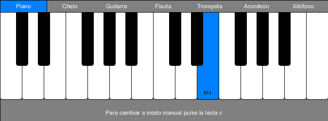

<h1>Sintetizador:</h1>

<p>En esta práctica se ha reproducido en comportamiento de un sintetizador muy básico en el cual se puede alternar entre la reproducción automática de una melodía o la activación del teclado manual. En el modo manual también se ha habilitado la posibilidad de grabar en un fichero midi la ejecución que realice en el teclado.</p>

<p>Como no se buscaba crear un sintetizador con una batería extensa de melodías en el modo automático, se ha almacenado en memoria una sola melodía. En caso de que cualquiera quisiera añadir más melodías lo podría hacer fácilmente editando el código. La melodía escogída fue el tema principal de la bagatela de Beethoven 'Para Elisa'.</p>

<p>Al ser un sintetizador, aunque sea básico, permite la activación de distintos instrumentos. Se han escogido los instrumentos de modo que las notas que puede reproducir el sintetizador concuerden con la tesitura natural de estos. La tesitura del sintetizador se extiende desde el Do3 al Do5 (ambos incluidos), y los instrumentos escogidos han sido: el piano, el chelo, la guitarra, la flauta, la trompeta, y el xilófono.</p>

<p>Para la realización del proyecto se ha utilizado la biblioteca SoundCipher para Processing.</p>

<h2>Detalles de implementación:</h2>

<p>El sintetizador se presenta con un menú de etiquetas para seleccionar el instrumento que se desee reproducir. Además, puede alternar entre el modo automático y el modo manual pulsando la tecla (c). La opción de grabación se activa únicamente en el modo manual pulsando la tecla (r). Para finalizar la grabación se puede pulsar de nuevo la tecla (r).</p>

<p>Existe la posibilidad de grabar varias veces sin necesidad de reiniciar la aplicación, solo que el archivo que quedará registrado será el de la última grabación. Después de la grabación se reproduce automáticamente el resultado de la misma, de modo que el usuario pueda saber si la grabación tiene la calidad suficiente o si requiere de un nuevo proceso de grabación. El fichero que se genera tiene el nombre de "melodia.mid" y se guarda en la raíz del programa processing, no en la raíz del proyecto.</p>

<h3>El modo automático:</h3>

<p>Para la generación de la melodía del módo automático se han utilizado tres vectores: pitches, dynamics, y durations. Pitches almacenara la secuencia de tonos midi en un vector de tamaño 35. El vector dynamics es de igual dimensión que pitches y almacena para todas sus posiciones un valor medio de 64. El último vector, durations, almacenará en las posiciones correspondientes a las figuras de corchea el valor 1 y en las posiciones de figuras de negra con puntillo el valor de 3. Estos valores establecen la duración del sonido en segundos. Para que el flujo natural del bucle del programa permita notas de tanta duración sin que se solapen y se silencien entre ellas se ha situado un comando delay proporcional al valor de duración de la nota. Se porbaron varios valores para el factor multiplicativo y finalmente se decidió dejarlo con valor 600.</p>

```java
if(modoAutomatico){
	if(i > 0){
		delay((int)durations[i-1] * 600);
	}else{
		delay((int)durations[34] * 600);
	}
}
```

<p>Un poco más abajo, en el método draw, se hace la llamada al método accionaTecla que será el que se encargue de iluminar la tecla que resonará y de emitir el sonido. La melodía se repite infinitamente recorriendo los vectores anteriormente descritos de modo circular.</p>

<p>El método acciona tecla recibe como parámetros un objeto Tecla y el valor del índice del recorrido por los vectores. La clase Tecla almacenará información útil para la ejecución de diferentes secciones dentro del método accionaTecla. En concreto almacena: la posición en el eje X de la esquina superior izquierda de la tecla; si es una nota natural o alterada; su tono en codificación midi; y su posición relativa a las notas de igual naturaleza, esto es si son naturales o alteradas.</p>

<p>Los objetos tecla se almacenarán en una estructura HashMap de modo que puedan ser accedidos por su clave, que será su código midi de tono. La variable HashMap toma el nombre de teclado y se carga una sola vez en el método setup.</p>

```java
// Ciclo infinito que reproduce cada nota en cada iteración de draw 
if(modoAutomatico){
    
	accionaTecla(teclado.get((int)pitches[i]), i);
    
	i++;
	if(i > 34){
		i = 0;
	}
    
}else{
	i = 0;
}
```

<p>En el método accionaTecla se pintan de azul las teclas accionadas dependiendo de si son naturales o alteradas, de su posición en el eje X y de su posición relativa dentro de las teclas de su naturaleza. Además, se pinta una etiqueta en la parte inferior de la tecla centrada en la misma con el nombre de la nota que se acciona. Finalmente en el método se hace la llamada al método que producirá el sonido.</p>

```java
void accionaTecla(Tecla t, int i){
  fill(0, 128, 255);
  textAlign(CENTER, TOP);
  textFont(createFont("Arial", 10));
  
  if(!t.getNatural()){
    // pinta la nota alterada
    rect(t.getPosX(), ALTO_MENU, 24, 110, 0, 0, 5, 5);
    fill(0);
    text(notas[t.getTono()-60], t.getPosX() + 12, ALTO_MENU + 160);
    
  }else{
    
    // pinta la nota natuaral
    rect(t.getPosX(), ALTO_MENU, 45, 180, 0, 0, 5, 5);   
    fill(0);
    
    text(notas[t.getTono()-60], t.getPosX()+22, ALTO_MENU + 160);
    
    int tecla = t.getPosTecla();
    switch(tecla){
      case 0:
      case 3:
      case 7:
      case 10:
        rect(tecla*45 + 33, ALTO_MENU, 24, 110, 0, 0, 5, 5);      
        break;
    
      case 2:
      case 6:
      case 9:
      case 13:
        rect((tecla-1)*45 + 33, ALTO_MENU, 24, 110, 0, 0, 5, 5);
        break;
      
      case 14:
        break;
      
      default:
        rect(tecla*45 + 33, ALTO_MENU, 24, 110, 0, 0, 5, 5);
        rect((tecla-1)*45 + 33, ALTO_MENU, 24, 110, 0, 0, 5, 5);
    }
  }
  
  sc.playNote(0, 2, instrumentos[cod_instrumento], pitches[i], dynamics[i], durations[i], 3, 64);
}
```

<p>La posición relativa de la tecla se utiliza para pintar las notas alteradas que pueden situarse a la derecha, a la izquierda, o a la derecha e izquierda de cada tecla natural, o en el caso de la última tecla natural, la 14, en el que no es necesario pintar ninguna tecla alterada a su alrededor. La posición relativa es únicamente necesaria en los casos en los que se pinte la tecla natural.</p> 

<h3>El modo manual:</h3>

<p>Para que la animación de la tecla iluminada al ser accionada, fue necesario reducir el frame rate a 3, de modo que la iluminación tuviese un tiempo suficiente para ser apreciada.</p>

<p>La lógica principal para esta funcionalidad se centra en el evento mousePressed. Como todas las notas naturales tienen un ancho igual a 45, lo primero que se hace es detectar en qué franja de nota natural se realizó la pulsción. Luego se comprueba si la pulsación se realizó a la altura de las teclas alteradas. Y por último, si la pulsación se realizó en el margen derecho o izquierdo, lo que significaría que la pusación podría ser sobre una tecla alterada. Las teclas alteradas tienen un ancho de 24, por lo que los margenes serán de 12 por cada lado.</p>

<p>Para detectar que tono adecuado se corresponde con la pulsación de ratón se utilizó dos variables: cod_nota y cod_nota_natural. En el caso en el que cod_nota y cod_nota_natural sean distintas se sabrá con seguridad que la nota es realmente una nota alterada.</p>

<p>Por último en el caso de que se pulse en el margen izquierdo de una tecla natural que a su izquierda tiene otra nota natural se le suma 1, que sería equivalente a hacer un redondeo superior. Con esta información se realiza la llamada al método coloreaTecla, y finalmente se pasa a emitir el sonido y a guardarlo en un objeto SCScore para volcarlo a un fichero midi. Este último pasa solo funcionará en el caso de que la grabación se haya activado.</p>

<p>Se comprueba que al pulsar en el margen izquierdo de la tecla inicial no se intente acceder a la tecla de su izquierda ya que no existe y se produciría un overflow. El mismo caso se chequea para la última nota si se pulsa en el margen derecho.</p>

```java

  if(!modoAutomatico && mouseY > ALTO_MENU){
    int tecla = (int)(mouseX/45);
    
    int cod_nota = midiNaturalSequence[tecla];
    int cod_nota_natural = cod_nota;
    
    int resto = mouseX % 45;
    if(mouseY < 110 + ALTO_MENU){
      
      if(resto > 33 && tecla < 14){
      
        cod_nota = (int)(cod_nota + midiNaturalSequence[tecla+1])/2; 
      
      }else if(resto < 12 && tecla > 0){
        
        float nota_alterada = (cod_nota + midiNaturalSequence[tecla-1])/2f;
        if(nota_alterada % 1 > 0){
          cod_nota = (int)nota_alterada + 1;
        }else{
          cod_nota = (int)nota_alterada;
        }
        
      }
      
    }

    coloreaTecla(tecla, cod_nota_natural, cod_nota);
    
    sc.playNote(0, 2, instrumentos[cod_instrumento], cod_nota, 64, 0.5, 3, 64);
    if(grabar){
      tiempo_nota = millis();
      int intervalo = tiempo_nota - tiempo_inicio_grabacion;
      
      score.addNote(intervalo/1000, 2, instrumentos[cod_instrumento], cod_nota, 64, 0.5, 3, 64);
    }
```

<p>El método coloreaTecla es similar a el método accionaTecla con lo que no requiere mayor explicación.</p>

```java
void coloreaTecla(int tecla, int cod_nota_natural, int cod_nota){
  fill(0, 128, 255);
  textAlign(CENTER, TOP);
  textFont(createFont("Arial", 10));
  
  if(cod_nota_natural != cod_nota){
    
    // pinta la nota alterada
    if(cod_nota > cod_nota_natural){
    
      rect(tecla*45 + 33, ALTO_MENU, 24, 110, 0, 0, 5, 5);    
      fill(0);
      text(notas[cod_nota-60], (tecla+1)*45, ALTO_MENU + 160);    
    
    }else{
      rect((tecla-1)*45 + 33, ALTO_MENU, 24, 110, 0, 0, 5, 5);
      fill(0);
      text(notas[cod_nota-60], (tecla)*45, ALTO_MENU + 160);
    }
    
  }else{
    
    // pinta la nota natuaral
    rect(tecla*45, ALTO_MENU, 45, 180, 0, 0, 5, 5);   
    fill(0);
    
    text(notas[cod_nota-60], tecla*45+22, ALTO_MENU + 160);
    
    switch(tecla){
      case 0:
      case 3:
      case 7:
      case 10:
        rect(tecla*45 + 33, ALTO_MENU, 24, 110, 0, 0, 5, 5);      
        break;
    
      case 2:
      case 6:
      case 9:
      case 13:
        rect((tecla-1)*45 + 33, ALTO_MENU, 24, 110, 0, 0, 5, 5);
        break;
      
      case 14:
        break;
      
      default:
        rect(tecla*45 + 33, ALTO_MENU, 24, 110, 0, 0, 5, 5);
        rect((tecla-1)*45 + 33, ALTO_MENU, 24, 110, 0, 0, 5, 5);
    }
  }
}
```

<p>Para la funcionalidad de salvado del fichero "melodia.mid" se utilizan tres variables: la bandera grabar y dos marcas de tiempo. Las marcas de tiempo serán la de el inicio de la grabación y la otra variable se utilizará para obtener la marca de tiempo de cada pulsación que luego servirá para hacer el cálculo de startBeat del método addNote.</p>

```java
  if(!modoAutomatico){
    if(key == 'r' || key == 'R'){
      if(grabar){
        score.play();
        score.writeMidiFile("melodia.mid");
        grabar = false;
      }else{
        score = new SCScore();
        tiempo_inicio_grabacion = millis();
        grabar = true;
      }
    }    
  }

```

<div align="center">
	<p></p>
</div>

<p>Esta aplicación se ha desarrollado como séptima práctica evaluable para la asignatura de "Creando Interfaces de Usuarios" de la mención de Computación del grado de Ingeniería Informática de la Universidad de Las Palmas de Gran Canaria en el curso 2019/20 y en fecha de 28/3/2020 por el alumno Juan Sebastián Ramírez Artiles.</p>

<p>Referencias a los recursos utilizados:</p>

- Modesto Fernando Castrillón Santana, José Daniel Hernández Sosa: [Creando Interfaces de Usuario. Guion de Prácticas](https://cv-aep.ulpgc.es/cv/ulpgctp20/pluginfile.php/126724/mod_resource/content/25/CIU_Pr_cticas.pdf).
- Processing Foundation: [Processing Reference.](https://processing.org/reference/).
- Biblioteca SoundCipher: [Home Page](http://explodingart.com/soundcipher/index.html)